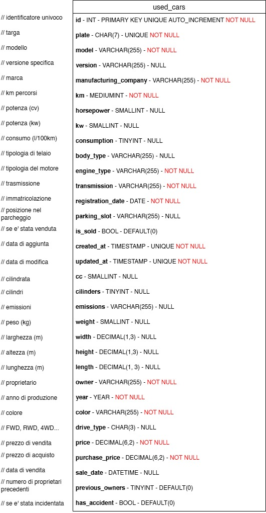

## Consegna
Modellizzare la struttura di una tabella per memorizzare tutti i dati riguardanti delle auto usate messe in vendita da un concessionario

Pushate nella repo lo screenshot dello schema della tabella.

### Screenshot

